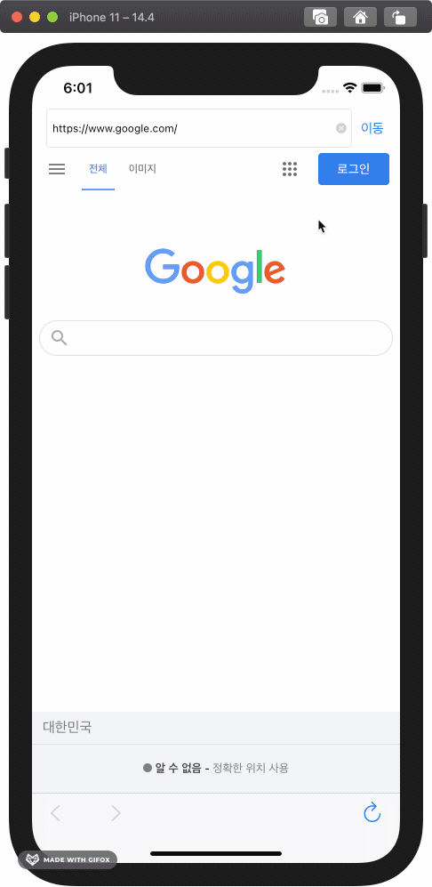
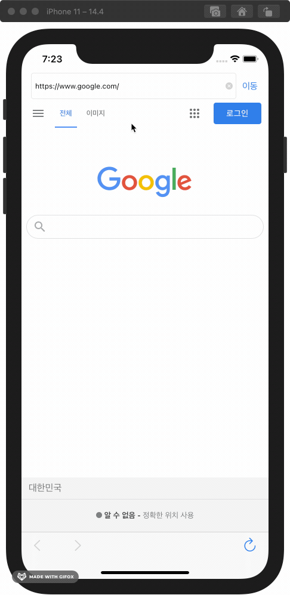
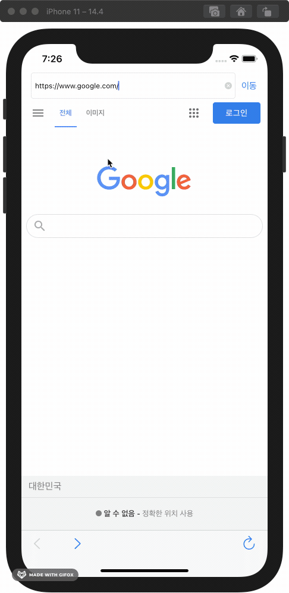

# 웹 브라우저
<!-- 뱃지 라인 -->

## 목차

1. [개요](#개요)
2. [기능](#기능)
3. [구현 내용](#구현-내용)
4. [배운 내용](#배운-내용)
5. [고민한 내용](#고민한-내용)
6. [개선하고 싶은 내용](#개선하고-싶은-내용)

## 1. 개요

- Webkit으로 구현한 웹 브라우저 앱
- 팀 프로젝트: `Jacob`, [`Lina`](https://github.com/lina0322), [`팀 그라운드 룰`](./GroundRule.md)
- 진행 기간: 2020.11.09~15 (1주)
- 학습 Keyword: `WebKit View` `Toolbar` `Button` `Text Field` `Alert`

## 기능

| 입력한 주소로 이동 | 잘못된 주소는 Alert 표시 | 
| :----------------: | :----------------------: |
|  |  |
| **주소에 "https://" 붙이기** | **앞/뒤로 가기, 새로 고침** | 
|  |  |

## 구현 내용

- 화면 구성
    - 주소 입력 필드
    - 웹 뷰
    - 주소입력 필드
    - 툴 바
        - 바 버튼 아이템
- 앞으로 가기, 뒤로 가기 버튼
- Alert 표시
- 정규식으로 주소에 https 포함했는지 검사
- 주소 입력 필드에 현재 URL 표시 (델리게이트)
- 주소로 이동 실패한 경우 에러 표시 (델리게이트)

## 배운 내용

- [메서드의 확장성 고려하기](#메서드의-확장성-고려하기)
- [Alert은 꼭 필요할 때 사용하기](#Alert은-꼭-필요할-때-사용하기)

### 메서드의 확장성 고려하기

- 배경
    - "앱을 실행하면 즐겨 찾는 웹페이지를 띄우기" 기능 구현
    - 즐겨 찾는 웹페이지 URL을 `Enum`타입으로 묶고, 이를 매개변수로 받아서 해당 URL로 이동하면 되겠다는 생각으로 메서드를 정의했다
    ~~~swift
    func load(favoriteWebPage: FavoriteWebPage)
    ~~~
- [코드리뷰 코멘트](https://github.com/yagom-academy/ios-web-browser/pull/8#discussion_r520636239)
    > 즐겨찾는 웹페이지만 불러올 수 있는 메서드라면 차후의 확장성 측면에서 괜찮을까요?
    > 기획서가 즐겨찾는 웹 페이지 뿐만 아니라 직접 입력한 웹 페이지도 불러올 수 있는 기능을 만들어 달라고 한다면 코드의 수정 없이 기능 추가/변경이 원활할 수 있을까요?
    > 정답은 없습니다. 열어두고 생각해봐도 좋을 포인트 인것 같아요  
- 개선
    - 처음 작성했던 메서드는 즐겨 찾는 웹 페이지만 매개변수로 받으므로, 직접 입력한 URL로 이동하는 기능을 위해서는 또 다른 메서드를 만들어야 한다. 
    - 비슷한 기능의 메서드가 두 개일 필요가 없고, URL을 매개변수로 받아 이동하는 메서드만 있으면 될 것이다.  
    ~~~swift
    func openPage(url: String)
    ~~~
- 배운 점
    - 개발자라면 무작정 구현할 것이 아니라, 기획의 변경 가능성과 여러 가지 상황에 대해서도 미리 고민하고 코드를 작성해야 한다

### Alert은 꼭 필요할 때 사용하기

- 배경
    - 앞으로/뒤로 가기 버튼을 눌렀을 때, 앞으로/뒤로 갈 수 없다면 Alert으로 에러를 띄우도록 구현
    - 사용자가 버튼을 눌렀는데 아무런 반응 없이 기능이 동작하지 않는다면 안 좋을 것이니, Alert으로 에러 내용을 표시하면 되겠다는 생각이었다
- [코드리뷰 코멘트](https://github.com/yagom-academy/ios-web-browser/pull/20#discussion_r521734482)
    > 사용자에게 알림을 주는 것은 좋지만, 무분별한 얼럿 사용은 오히려 사용자 경험을 해칠 수 있습니다.
    > 적절한 피드백을 고민해봐야합니다.
    > 앞으로 갈 수 없는 상황이라면 앞으로가기 버튼을 비활성화 하는 것만으로도 충분한 피드백이 되지 않을까요?

- 개선
    - 코멘트의 방식이 적절하겠다고 판단했다
    - 웹페이지 이동을 완료할 때마다 앞으로/뒤로 갈 수 있는지 체크하고 갈 수 없다면 버튼을 비활성화 되도록 구현
    ~~~swift 
    extension ViewController: WKNavigationDelegate {
        func webView(_ webView: WKWebView, didFinish navigation: WKNavigation!) {
            goForwardButton.isEnabled = webView.canGoForward
            goBackButton.isEnabled = webView.canGoBack
        }
    }
    ~~~
- 배운 점
    - Alert 사용은 꼭 필요할 때만
    - H.I.G 문서를 읽어봐야 한다. [Feedback - Alert관련 내용](https://developer.apple.com/design/human-interface-guidelines/ios/user-interaction/feedback/)

## 고민한 내용

- [메서드의 재사용성](#메서드의-재사용성)
- 메서드의 확장성 관련 (Step1 PR)
- 메서드 정의 순서 (Step4 PR)
- 웹 페이지 로딩중에 다른 주소를 입력하면 뒤에요 요청된 URL 무시 (Step4 PR)

### 메서드의 재사용성

`입력한 URL로 Web View를 이동하는 메서드`를 `ViewController`에 정의했다. 이 메서드를 만약 다른 `ViewController`에서 사용하려면 메서드를 복붙해야 하는데 더 나은 방법은 없을까?
- `UIViewController`를 extension 해서 메서드를 정의하면 모든 `ViewController`에서 사용할 수 있겠네?
    - 하지만 모든 `ViewController`가 `Web View`와 `입력한 URL로 Web View를 이동하는 메서드`가 필요한 건 아니다
- `WKWebView`를 extesnsion 해서 메서드를 정의하면 `WKWebView`를 사용하는 곳에서 모두 이 기능을 사용할 수 있겠네?
    - `WKWebView`를 사용하는 모든 곳에서 이 기능이 필요할까? 그렇다면 애플에서 이미 구현 해놨을 것이다
- `입력한 URL로 Web View를 이동하는 메서드`와 `WKWebView.load(_:)`의 차이는 URL이 무효일 경우 에러 표시를 해주는 것뿐이다
- 결론
    - 프로젝트의 `ViewController`에서만 사용할 것이므로 이곳에 정의
    - 이 경우 말고, 기능을 재사용할 방법은 extension뿐 아니라, 전용 객체를 만들어 사용하면 될 것이다.

## 개선하고 싶은 내용

- 뒤로 가기, 앞으로 가기, 새로 고침 기능을 Webkit 메서드를 사용하지 않고 구현해보기
- 상/하단의 Bar가 항상 보이고 있어서 웹 뷰 영역이 비좁아 보인다. 사파리 앱처럼 아래로 스크롤 시에 상/하단 Bar를 최소화하고, 위로 스크롤 시에 다시 보이게 하는 기능을 구현 해 보기
- 에러 핸들링 Error 프로토콜 사용하기, 에러 핸들링 분리하기
- 다크모드 대응