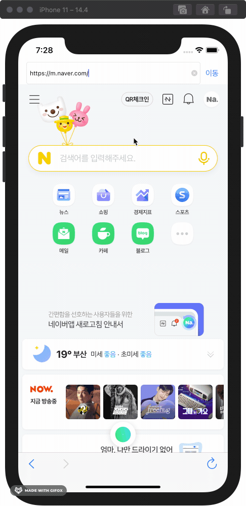

# 웹 브라우저 앱
<!-- 뱃지 라인 -->

## 개요

- Webkit으로 구현한 웹 브라우저 앱
- 팀 프로젝트: `Jacob`, [`Lina`](https://github.com/lina0322)
- 진행 기간: 2020.11.09~15 (1주)
- 학습 Keyword: `Text Field`, `Alert`, `Web View`, `Toolbar`, `Button`, `URL`, `정규식`
- 기능

| 입력한 주소로 이동 | 잘못된 주소는 Alert 표시 | 주소에 "https://" 붙이기 | 앞/뒤로 가기, 새로 고침 | 
| :----------------: | :----------------------: | :----------------------: | :---------------------: |
|  |  |  |  |

   

## 목차

1. [프로젝트](#프로젝트)
    - [팀원과 역할 분배](#팀원과-역할-분배)
    - [Git & GitHub으로 협업하기](#Git--GitHub으로-협업하기)
    - [팀 그라운드 룰](#팀-그라운드-룰)
    - [TWL](#This-week-We-Learned)
2. [학습 내용](#1-학습-내용)
    - [Text Field](#Text-Field)
        - [텍스트 입력받고 사용하기](#텍스트-입력받고-사용하기)
        - [Keyboard Type 설정하기](#Keyboard-Type-설정하기)
    - [Alert 표시하기](#Alert-표시하기)
    - [Web View](#Web-View)
        - [입력한 주소로 이동하기](#입력한-주소로-이동하기)
        - [앞으로 가기, 뒤로 가기, 새로고침](#앞으로-가기-뒤로-가기-새로고침)
    - [Toolbar or Tab Bar?](#Toolbar-or-Tab-Bar)
    - [String을 URL 타입으로 변환하기](#String을-URL-타입으로-변환하기)
    - [정규식으로 주소에 https 포함했는지 검사](#정규식으로-주소에-https-포함됐는지-검사)
3. [배운 내용](#2-배운-내용)
    - [메서드의 확장성 고려하기](#메서드의-확장성-고려하기)
    - [Alert은 꼭 필요할 때 사용하기](#Alert은-꼭-필요할-때-사용하기)
4. [고민한 내용](#3-고민한-내용)
    - [메서드의 재사용성](#메서드의-재사용성)
    - [사용자가 이동 버튼을 여러 번 다시 누를 경우](#사용자가-이동-버튼을-여러-번-다시-누를-경우)
5. [개선하고 싶은 내용](#4-개선하고-싶은-내용)

   

## 프로젝트

- Webkit으로 구현한 웹 브라우저 앱
- 진행 기간: 2020.11.09~15 (1주)

### 팀원과 역할 분배

- `Jacob`, [`Lina`](https://github.com/lina0322)
- **역할을 나누지 않고 각자의 방법대로 구현한 후, 리뷰를 통해 더 나은 코드로 통합하기**  
    iOS 프로젝트 경험과 협업 경험이 모두 부족해서 어떤 기준으로 역할을 나누어야 할지 감이 오질 않았다.  
    프로젝트의 규모가 그리 크지 않아 기능별로 구분하기 애매하고, 서로 많은 것을 경험해보고 싶은 욕심도 있어서 이러한 방식으로 결정했다.

### Git & GitHub으로 협업하기

팀으로 진행하는 첫 프로젝트라서 시행착오가 있겠지만, Git과 GitHub으로 협업하기 위환 최소한의 규칙을 정하고 지키기 위해 노력하기로 했다.  

- 서로의 코드 리뷰
    - 각자 구현하기로한 부분이 완료되면 PR을 통해 리뷰하고 머지하기
    - 팀 그라운드 룰로 정한 규칙 위주로 점검하고 의견 말하기
- 회고  
    음성 채팅을 통해 서로 의견을 나누었지만 따로 기록하지 않은 것이 후회된다. 이후 프로젝트에서는 대화로 주고받은 의견과 결정 내용을 정리해두어야겠다.

[👆목차로 가기](#목차)
   

### 팀 그라운드 룰

- 우리 팀만의 규칙
    - 오전 11시에 30분 이내로 스크럼하기
    - 오후 10시 이후에는 팀원에게 연락하지 않기
    - 교육시간 외에는 회의실에서 같이 진행
    - 오랜시간 자리를 비우게 될 때는 얘기해준다
- 스크럼 주제
    - 어제 하기로 한 것 중에 못한 것 이야기
    - 오늘 할 일 위주로 이야기하기
    - 컨디션 공유하기!

#### 프로젝트 진행 규칙

- 브랜치 이름 규칙
    - 스텝별로 공동 브랜치 생성 "스텝-1", 개인 브랜치 "스텝-1-닉네임-기능". 
    - ex) step-1-jacob-feature
- 커밋 단위
    - func 하나 단위로는 꼭 커밋 해주기(최대한 자주)
    - 실행 가능한 상태에서 커밋 하기
- 코딩 컨벤션
    - Swift API 디자인 가이드라인을 따르려고 노력한다
    - 클래스, 함수, 변수 명을 명확하고 객관적인 이름으로 하기
    - 주석 잘 남기기 (함수 설명은 퀵헬프 기능으로 작성) 
- PR
    - 각자 기능이 완성되면 공동 step 브랜치로 PR 보내고 코드리뷰 후 머지한다. 
    - step별 브랜치 완료되면 야곰 저장소로 PR한다.

#### 커밋 메시지 규칙

- 한글로 작성하기 (단, 제목의 Type은 영문으로 작성)
- 제목작성 Type : 제목
    - Feat : 코드, 새로운 기능 추가
    - Fix : 버그 수정
    - Docs : 문서 수정
    - Style : 코드 스타일 변경 (기능, 로직 변경 x)
    - Test : 테스트 관련
    - Refactor : 코드 리팩토링
- title은 간단하게 description은 자세히! 

~~~
type : title    // 제목
                // 제목과 본문 사이에 한칸 공백
이곳에는 설명   // 설명
~~~

~~~
// 샘플
Feat : 로그인 기능 추가

땡땡댕 클래스를 사용하여 로그인 시도하고...
~~~

[👆목차로 가기](#목차)
   

### This week We Learned

웹 브라우저 앱 프로젝트 팀 주간 회고

#### 타임 라인

월 - 프로젝트 파악
화 - 그라운드 룰 작성, step1  
수 - step2, step3  
목 - step3, step4  
금 - step4, step5  

#### 잘한 점 

- 팀 그라운드 룰을 정할 때 서로 의견을 내고 원활하게 소통했다. 
- 팀원 각자가 새로 알게 된 내용을 서로 공유하고 설명해 주었다 
- 한 주 내내 서로 마음 상하지 않고, 재미있게 의견을 공유하였다. 
- 팀 그라운드 룰을 잘 지켰다.(연락 및 다양한 부분 포함) 
- 서로 이해하고 배려해 주려고 노력했다. 

#### 개선할 점 

목표한 기간까지 끝내는 것도 중요하다는 것을 알지만, 아쉬운 점이 보이면 고치고 싶은 마음이 들어서 시간이 많이 지체된 것 같다.  

다음 프로젝트에서는 적당히 밸런스를 맞추는 연습을 더 해야겠다. 

#### 학습 키워드 

- WKWebView 
- Delegate 
- Optional 
- WKNavigationDelegate 
- 정규식 

#### 칭찬하기 

- **제이콥이 리나에게**  
    다양한 방법으로 시도하려는 노력을 많이 해서 내가 생각하지 못한 방법들을 자주 발견해 주어 배운 것이 많았다. 나는 한 가지 방식에 생각이 꽂히면 그길로만 파고드는 스타일인데 그럴 때 단점을 보완해주는 팀원이었다.

- **리나가 제이콥에게**  
    항상 침착한 제이콥과 함께해서 좋았습니다! 어려워서 제 멘탈이 왔다 갔다 하는데도, 침착하게 리드해주는 느낌이었습니다. 제가 이해하지 못하는게 있어도, 여러 차례 다시 설명해 주고 보여주고 이해할 때까지 기다려줘서 감동이었습니다.
    제가 무언가를 시도하려고 할 때에도, 넓은 포옹력으로 지켜봐 주고, 보완해주고, 받아주는 제이콥 최고예요
    한 주 동안 고생하셨고, 감사합니당

[👆목차로 가기](#목차)
   

## 학습 내용

### Text Field

#### 텍스트 입력받고 사용하기

1. `ViewController`에 `@IBOutlet` 프로퍼티로 연결.
    ~~~swift
    class ViewController: UIViewController {
        @IBOutlet weak var urlTextField: UITextField!
    }
    ~~~
2. 이제 `Text Field`를 터치하면 글자를 입력할 수 있다.
3. 입력받은 글자는 `Text Field`의 `text`프로퍼티로 접근하여 가져올 수 있다. `Optional`이므로 안전하게 `Optional Unwrapping`하여 사용하자.
    ~~~swift
    if let urlText = urlTextField.text {
        // use urlText
    }
    ~~~

[👆목차로 가기](#목차)
   

#### Keyboard Type 설정하기

입력받을 콘텐츠에 맞는 Keyboard Type을 설정하면 사용자가 더 편리해할 것이므로 꼭 하자.  
(핸드폰 번호를 입력하는 Text Field라면 문자는 불필요하므로 숫자패드가 보이면 더 누르기 쉬울 것이다.)

- [H.I.G - Text Fields 읽어보기](https://developer.apple.com/design/human-interface-guidelines/ios/controls/text-fields/)
- 스토리보드에서 Text Field 선택 후 Attributes Inspector -> Text Input Traits -> Keyboard Type에서 설정
- 웹 주소를 입력받으므로 `URL` Type으로 설정하니, 키보드의 `.`, `/`, `.com`등 URL 작성에 유용하게 배치됐다.

[👆목차로 가기](#목차)
   

### Alert 표시하기

~~~swift
func showError(error: ErrorMessage) {
    // 1. Alert Controller 생성
    let errorAlert = UIAlertController(title: "Error!", message: error.rawValue, preferredStyle: .alert)
    // 2. Action 버튼 생성
    let ok = UIAlertAction(title: "확인", style: .default, handler: nil)
    // 3. Alert Controller에 Action 추가
    errorAlert.addAction(ok)

    // 4. Alert 띄우기
    self.present(errorAlert, animated: false)
}
~~~
- [Getting the User's Attention with Alerts and Action Sheets 읽어보기](https://developer.apple.com/documentation/uikit/windows_and_screens/getting_the_user_s_attention_with_alerts_and_action_sheets)
- UIAlertController.Style
    - actionSheet: 화면 아래에서 슬라이드 되며 올라온다. 2개 이상의 Action을 사용할 때 주로 사용
    - alert: 화면 가운데에 표시. 2개의 Action을 사용할 때 주로 사용
- UIAlertAction.Style
    - default
    - cancel: 취소 Action에 사용. default보다 글자가 굵다
    - destructive: 데이터의 수정/삭제 Action에 사용. 글자 빨간색으로 표시

[👆목차로 가기](#목차)
   

### Web View

#### 입력한 주소로 이동하기

1. Web View로 웹 페이지 불러오기

    입력한 주소를 String -> URL -> URLRequest 순서로 변환하여 WKWebView `load(_:)` 메서드의 인자로 넣어 호출한다.
    ~~~swift
    func openPage(url: String) {
        // 1. URL 객체 생성
        guard let url = URL(string: url) else {
            return
        }
        // 2. URLRequest 객체 생성
        let request = URLRequest(url: url)
        // 3. Web View로 웹 페이지 불러오기
        webView.load(request)
    }
    ~~~

2. 현재 웹 페이지의 주소 표시하기

    이동이 완료 됐다면, 주소 Text Field에 현재 웹 페이지의 주소를 보여주자. 
    ~~~swift
    func webView(_ webView: WKWebView, didFinish navigation: WKNavigation!) {
        urlTextField.text = webView.url?.absoluteString
    }
    ~~~
    - WKNavigationDelegate `webView(_:didFinish:)` 메서드는 Web View의 이동이 완료되면 호출된다.

[👆목차로 가기](#목차)
   

#### 앞으로 가기, 뒤로 가기, 새로고침

1. 앞으로/뒤로 가기, 새로고침 기능 구현

    WKWebView 클래스에 goForward(), goBack(), reload() 메서드가 이미 정의돼있으므로, 버튼의 액션 메서드에서 호출해 준다.
    ~~~swift
    @IBAction func goForwardPage(_ sender: UIBarButtonItem) {
        webView.goForward()
    }

    @IBAction func goBackPage(_ sender: UIBarButtonItem) {
        webView.goBack()
    }

    @IBAction func reloadPage(_ sender: UIBarButtonItem) {
        webView.reload()
    }
    ~~~

2. 앞으로/뒤로 갈 수 있을 때만 버튼 활성화하기

    만약 열어본 웹 페이지가 하나 뿐이라면, 앞/뒤 페이지가 없으므로 해당 버튼을 눌러도 이동하지 않을 것이다.  
    이 때, 사용자는 기능에 문제가 있다고 생각할 수 있으므로 이동할 수 없을 때에는 버튼을 비활성화 해준다.  

    Web View의 이동이 완료될 때마다 WKWebView `canGoForward`/`canGoBack` 프로퍼티로 확인해서 버튼을 활성/비활성 해준다.
    ~~~swift
    func webView(_ webView: WKWebView, didFinish navigation: WKNavigation!) {
        goForwardButton.isEnabled = webView.canGoForward
        goBackButton.isEnabled = webView.canGoBack
    }
    ~~~

[👆목차로 가기](#목차)
   

### Toolbar or Tab Bar?

화면 하단에 `Bar`를 사용한다면 `Toolbar`와`Tab Bar`의 차이를 잘 이해해야 한다.
- [H.I.G - Toolbars 읽어보기](https://developer.apple.com/design/human-interface-guidelines/ios/bars/toolbars/)
- Toolbar: 현재 화면과 관련된 기능. 즉, `도구` 개념 (Ex: 사진 앱의 공유/하트/삭제 버튼)
- Tab Bar: 앱의 다른 섹션으로 빠르게 전환해 줌 (EX: 시계 앱의 세계 시계/알람/스톱워치/타이머 탭)
- `앞으로/뒤로 가기`, `새로 고침` 버튼은 웹 브라우저의 도구 역할을 하므로 `Toolbar`를 사용했다.

[👆목차로 가기](#목차)
   

### String을 URL 타입으로 변환하기

1. `URL`의 생성자 `init(string:)`으로 String 텍스트를 URL타입으로 생성한다. 
    ~~~swift
    if let url = URL(string: urlText) {
        // use url
    }
    ~~~
2. 이 생성자는 string이 유효하지 않다면, nil을 반환한다. 이것을 활용하면 입력한 주소의 유효성을 검증할 수 있다.
    > **Developer Document > URL > init(string:)**  
    > This initializer returns nil if the string doesn’t represent a valid URL. For example, an empty string or one containing characters that are illegal in a URL produces nil.

[👆목차로 가기](#목차)
   

### 정규식으로 주소에 https 포함됐는지 검사

주소를 입력할 때 `https://`을 붙이지 않고 `naver.com`을 입력한다면 URL 타입 생성이 실패한다.  
입력한 주소를 미리 검사해서, 사용자가 `https://`를 입력하지 않았다면 자동으로 붙여주는 기능을 만들었다.  

~~~swift
func checkFront(of url: String?) -> Bool {
    let urlRegex = "((http|https)://)[\\S]+"
    
    return NSPredicate(format: "SELF MATCHES %@", urlRegex).evaluate(with: url)
}
~~~
> 이 기능은 팀원 `Lina`가 구현 후 설명해 주었고, 사용된 정규식 내용을 정리했다.
- 메타 문자: 정규식에서 일정한 의미를 가지고 쓰는 특수문자
- `http|https`: 메타 문자 `|`는 `or`을 의미하므로 `http 또는 https`를 의미
- `((http|https)://)`: 메타 문자 `()`는 서브 패턴을 지정하므로, `http:// 또는 https://`를 의미
- `[\\S]+`
    - 메타 문자 `\S`는 공백문자를 제외한 문자를 의미하고, Swift에서는 역슬래쉬 하나를 더 붙여서 `\\S`로 사용
    - 메타 문자 `+`는 앞 문자가 1개 이상을 의미하므로, `http:// 또는 https://`가 문자내에 1개 이상 있다는 것을 의미

[👆목차로 가기](#목차)
   

## 배운 내용

### 메서드의 확장성 고려하기

- 배경  
    즐겨 찾는 웹페이지의 주소를 받아 Web View에 띄우는 메서드를 구현했다.  
    즐겨 찾는 URL을 `Enum`타입으로 묶고, 이를 매개변수로 받아서 해당 URL로 이동하면 되겠다는 생각이었다.
    ~~~swift
    func load(favoriteWebPage: FavoriteWebPage)
    ~~~
-  [코드리뷰 코멘트](https://github.com/yagom-academy/ios-web-browser/pull/8#discussion_r520636239)  
    > 즐겨찾는 웹페이지만 불러올 수 있는 메서드라면 차후의 확장성 측면에서 괜찮을까요?  
    > 기획서가 즐겨찾는 웹 페이지 뿐만 아니라 직접 입력한 웹 페이지도 불러올 수 있는 기능을 만들어 달라고 한다면 코드의 수정 없이 기능 추가/변경이 원활할 수 있을까요?  
    > 정답은 없습니다. 열어두고 생각해봐도 좋을 포인트 인것 같아요  
- 개선  
    즐겨 찾는 웹 페이지만 매개변수로 받으므로, 직접 입력한 URL로 이동하는 기능을 위해서는 또 다른 메서드를 만들어야 한다.  
    비슷한 기능의 메서드가 두 개일 필요가 없으니, URL을 매개변수로 받아 이동하도록 수정했다.
    ~~~swift
    func openPage(url: String)
    ~~~
- 배운 점  
    메서드를 작성할 때는 기획의 변경과 여러 가지 상황 등에 더 쉽게 대응할 수 있는 방향으로 확장성을 고려해야 한다.

[👆목차로 가기](#목차)
   

### Alert은 꼭 필요할 때 사용하기

- 배경  
    앞으로/뒤로 가기 버튼을 눌렀을 때, 앞으로/뒤로 갈 수 없다면 Alert으로 에러를 띄우도록 구현했다.  
    사용자가 버튼을 눌렀는데 아무런 반응 없이 기능이 동작하지 않는다면 안 좋을 것이니, Alert으로 에러 내용을 표시하면 되겠다는 생각이었다  
- [코드리뷰 코멘트](https://github.com/yagom-academy/ios-web-browser/pull/20#discussion_r521734482)
    > 사용자에게 알림을 주는 것은 좋지만, 무분별한 얼럿 사용은 오히려 사용자 경험을 해칠 수 있습니다.  
    > 적절한 피드백을 고민해봐야합니다.  
    > 앞으로 갈 수 없는 상황이라면 앞으로가기 버튼을 비활성화 하는 것만으로도 충분한 피드백이 되지 않을까요?  
- 개선  
    코멘트의 방식이 적절하겠다고 판단하여 수정했다.  
    웹페이지 이동을 완료할 때마다 앞으로/뒤로 갈 수 있는지 체크하여, 갈 수 있으면 버튼을 활성화하고, 아니면 비활성화한다.
    ~~~swift 
    extension ViewController: WKNavigationDelegate {
        func webView(_ webView: WKWebView, didFinish navigation: WKNavigation!) {
            goForwardButton.isEnabled = webView.canGoForward
            goBackButton.isEnabled = webView.canGoBack
        }
    }
    ~~~
- 배운 점  
    - Alert은 꼭 필요할 때만 사용해야 한다.
    - H.I.G 문서는 매우 중요하다! [Feedback - Alert관련 내용](https://developer.apple.com/design/human-interface-guidelines/ios/user-interaction/feedback/)

[👆목차로 가기](#목차)
   

## 고민한 내용

### 메서드의 재사용성

- 배경  
    입력한 URL로 Web View를 이동하는 메서드를 `ViewController`에 정의했다.  
    이 메서드를 만약 다른 `ViewController`에서 사용하려면 메서드를 복붙해야 하는데 더 나은 방법은 없을까?
- 고민의 흐름  
    1. `UIViewController`를 extension 해서 메서드를 정의하면 모든 `ViewController`에서 사용할 수 있겠네?  
        하지만 모든 `ViewController`가 `Web View`와 `입력한 URL로 Web View를 이동하는 메서드`가 필요한 건 아니다
    2. `WKWebView`를 extesnsion 해서 메서드를 정의하면 `WKWebView`를 사용하는 곳에서 모두 이 기능을 사용할 수 있겠네?  
        `WKWebView`를 사용하는 모든 곳에서 이 기능이 필요할까? 그렇다면 애플에서 이미 구현 해놨을 것이다  
    3. `입력한 URL로 Web View를 이동하는 메서드`와 `WKWebView.load(_:)`의 차이는 URL이 무효할 경우 에러 표시를 해주는 것뿐이다
- 결론  
    프로젝트의 `ViewController`에서만 사용할 것이므로 `ViewController`에 정의했다.

[👆목차로 가기](#목차)
   

### 사용자가 이동 버튼을 여러 번 다시 누를 경우

- 배경
    입력한 URL로 Web View를 이동하는 메서드를 구현했다.  
    만약 사용자가 이동 버튼을 여러번 다시 눌러서 메서드가 계속 실행된다면?
- 고민의 흐름
    1. 사용자가 이동 버튼을 연속해서 계속 누른다면 웹 페이지 로딩이 끝나기 전에 계속 재시도할 것이다.  
        이것은 사용자 데이터를 불필하게 더 소모하는 것이니 막는 것이 좋겠다.  
        ~~~swift
        func openPage(url: String) {
            guard !webView.isLoading else {
                return
            }
            guard let url = URL(string: url) else {
                return showError(error: .url)
            }

            let request = URLRequest(url: url)
            webView.load(request)
        }
        ~~~
    2. [코드리뷰](https://github.com/yagom-academy/ios-web-browser/pull/31/files/cceed8b192bec5c901d8f047b5039e5da51997af#r522941512)에서 예상하지 못한 상황을 알게 되었다.  
        > 궁금한 것이 있습니다  
        > webView가 _www.naver.com_를 요청하고 로딩 중에  
        > www.yagom.net 을 입력하면 뒤에 요청된 www.yagom.net 이 무시되야하나요?  
    만약 인터넷 속도가 매우 느린 상황이라면 유저는 다른 페이지로 이동하고 싶지만 버튼을 눌러도 이동하지 못하는 상황이 발생할 것이다.
- 결론  
    사파리 앱의 경우에는 별다른 대응 없이 계속 새로 요청이 되었다.  
    다른 방법으로 새로 요청한 주소가 직전에 입력한 주소와 같다면 무시하는 방법이 생각났지만,  
    프로젝트 기능 명세서에 해당 내용은 없으므로 우선은 매번 새로 요청되도록 하고, 차후 시간 여유가 있다면 적용해보기로 했다.  
    ~~~swift
    func openPage(url: String) {
        guard !webView.isLoading else {
            return
        }
        guard let url = URL(string: url) else {
            return showError(error: .url)
        }

        let request = URLRequest(url: url)
        webView.load(request)
    }
    ~~~

[👆목차로 가기](#목차)
   

## 개선하고 싶은 내용

- 뒤로 가기, 앞으로 가기, 새로 고침 기능을 Webkit 메서드를 사용하지 않고 구현해보기
- 상/하단의 Bar가 항상 보이고 있어서 웹 뷰 영역이 비좁아 보인다. 사파리 앱처럼 아래로 스크롤 시에 상/하단 Bar를 최소화하고, 위로 스크롤 시에 다시 보이게 하기
- 에러 핸들링 Error 프로토콜 사용하기, 에러 핸들링 분리하기
- 다크 모드 대응하기

[👆목차로 가기](#목차)
   